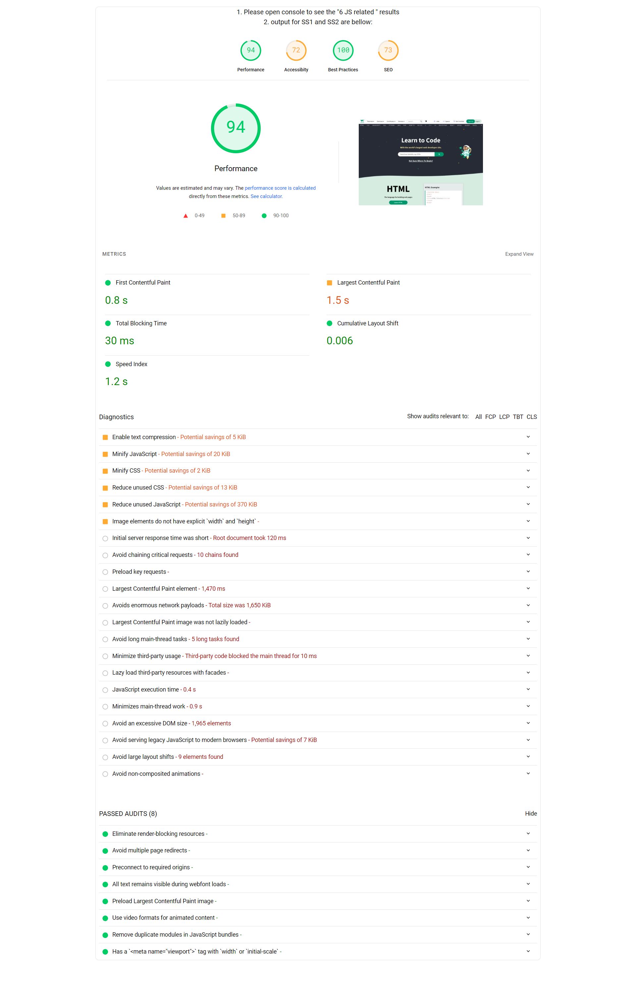
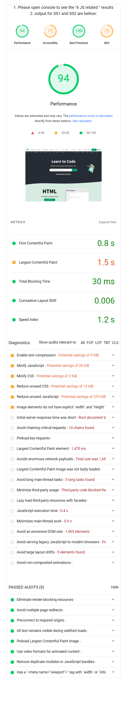

# This a project for evaluating my skills on react.js and other front end technologies by Encoder IT. 

## instruction repo: https://github.com/encoderit-anik/pagespeed/tree/main 
# Live preview link: [https://encoderit-test.vercel.app/](https://encoderit-test.vercel.app/)

### info: Answer for JavaScript questions are in the `src/JsAnswers.jsx` file

## Features: 
- did not use any third party library for styling or functionality. 
- used only vanilla javascript, react.js, pure css. 
- circular progress bar is a fully custom made and reusable. it can produce different color based on logic and scores.  
- no data is static here. all the data are dynamic and coming from a [REST API](https://raw.githubusercontent.com/encoderit-anik/pagespeed/main/w3.json) using fetch api. 
- colors and icons are also dynamic based on the scores.
- fully responsive design. looks good on mobile and desktop.
- used Context API to manage states and share data between components.
- User can click on expand buttons to see more details about the audit result. 

 